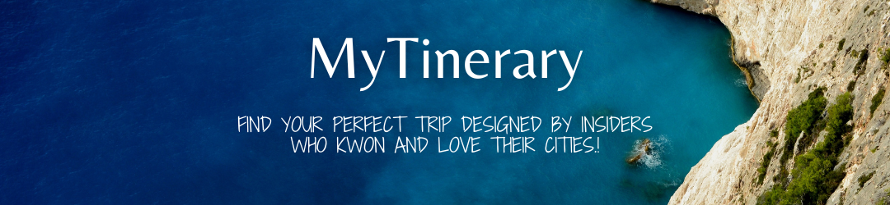

# Desarrolado Por Marco Castellacci

Proyecto de App creada con [create-react-app](https://create-react-app.dev/)

Desarrollo parte del proceso de aprendizaje del Bootcamp de **Minfhub**

## Tecnologias utilizadas y Herramientas utilizadas

* React
* Node JS
* Express
* MongoDB
* Mongoose
* Postman
* React-Router-Dom

## Componentes de Librerias

* Material UI
* Swiper

## Lenguajes aplicados

* JavaScript
* CSS
* HTML
* Markdown
* JSON
* JSX

Aplicacion con dependencias de npm y Backend con Express completamente desarrollado en NodeJS